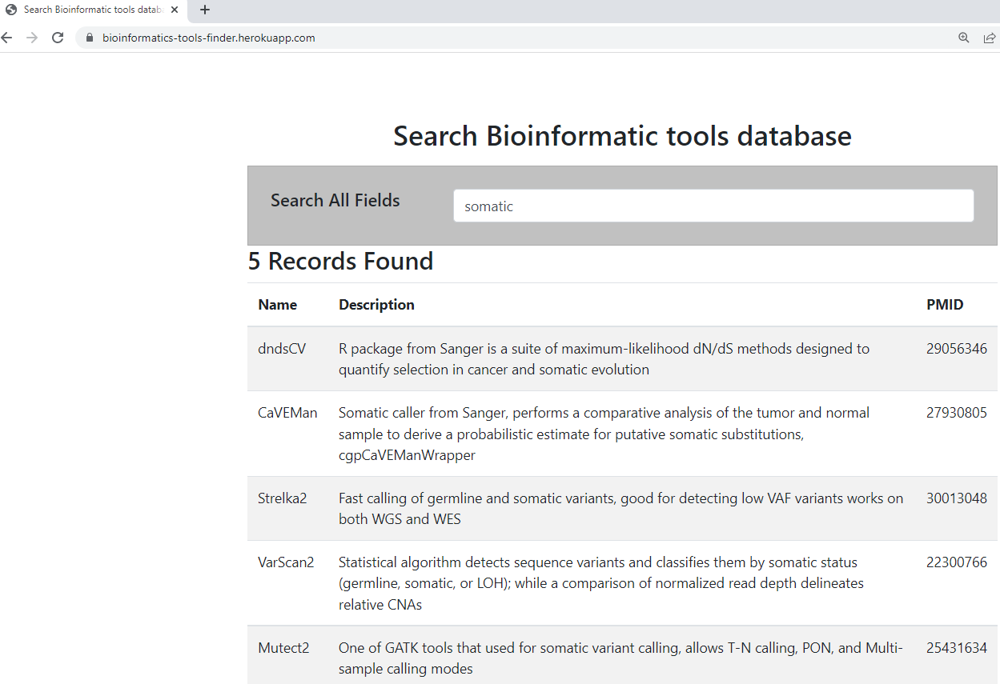
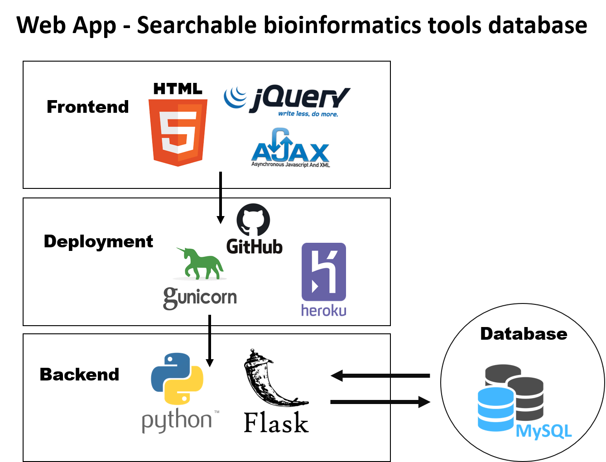

# Web app for quick search of bioinformatics tools
Using : Python * Flask * MySQL * Heroku

Web app link: https://bioinformatics-tools-finder.herokuapp.com

### Design and deployment:

- [Wep App coding using VS code](https://github.com/AAlhendi1707/bioinformatics-tools-finder/blob/main/design.md)
- [Deployment to heroku](https://github.com/AAlhendi1707/bioinformatics-tools-finder/blob/main/deployment.md)

